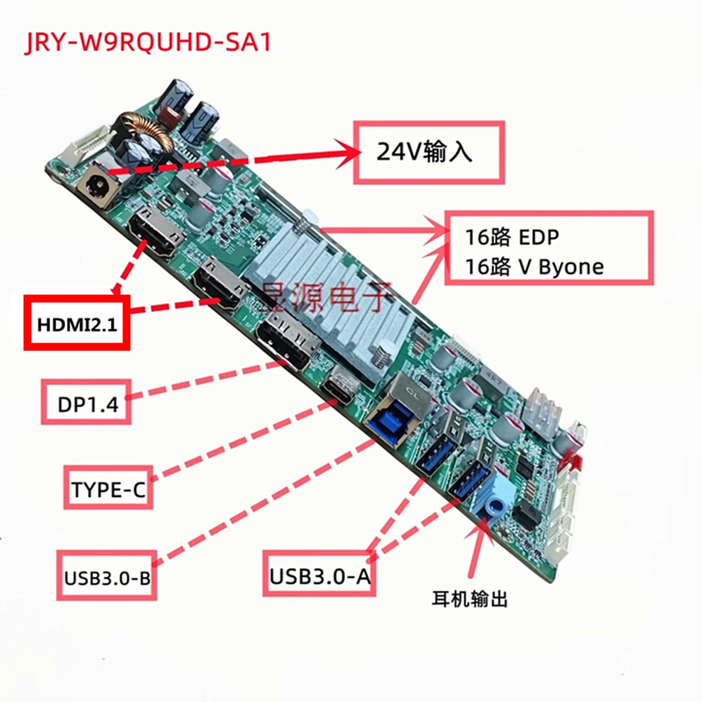

# JRY-W9RQUHD-SA1

## Outputs

## Power

- The input DC is a 2.5mm x 5.5mm
- The inner pin is `ve+`

## Fanless

We have little feedback yet on SA1 project regarding heat, especially when using the USB-C to charge a laptop. Useing some kind of case ventilation might be needed for this.

## Some build using the SA1

- [Pnwkayaker](https://forums.macrumors.com/threads/diy-5k-monitor-success.2253100/page-121?post=34053968#post-34053968)
- [Xarli](https://forums.macrumors.com/threads/diy-5k-monitor-success.2253100/post-33431505)
- [Subdriver](https://forums.macrumors.com/threads/diy-5k-monitor-success.2253100/post-33923724)
- [Coles](https://forums.macrumors.com/threads/diy-5k-monitor-success.2253100/post-33826568)
