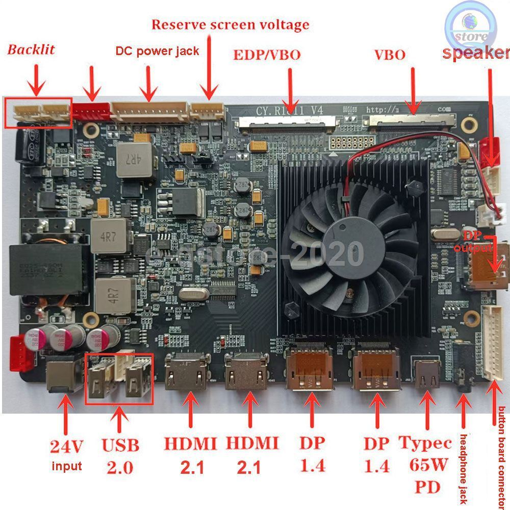

# R1811

*R1811 connections*

# Fan noise

The fan  on the R1811 can be pretty noisy.
- It can be replaced by a quieter one, like the Noctua NF-A1x10.
- A 100/150 Ohm resistance can also be added inbetween. Either a custom built or using the NA-RC11 and NA-RC7 which are often shipped with Noctua Fans.
