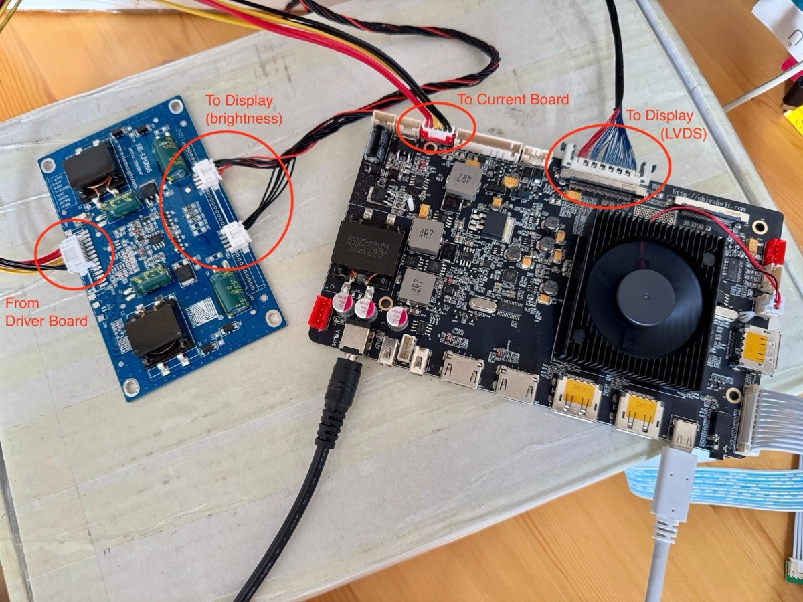

# Current Board

If working i a very sunny environment you might need to add a current board, between the video controller and the display.

> [!TIP]
> Most user find the screen is bright enough without it.

## Cabling example

_Credit to Joyrzc_

## Buying links

[AliExpress](https://fr.aliexpress.com/item/1005001660237411.html?gatewayAdapt=glo2fra)

> [!WARNING]
> Be careful to buy the one matching your Display manufacturing code.
