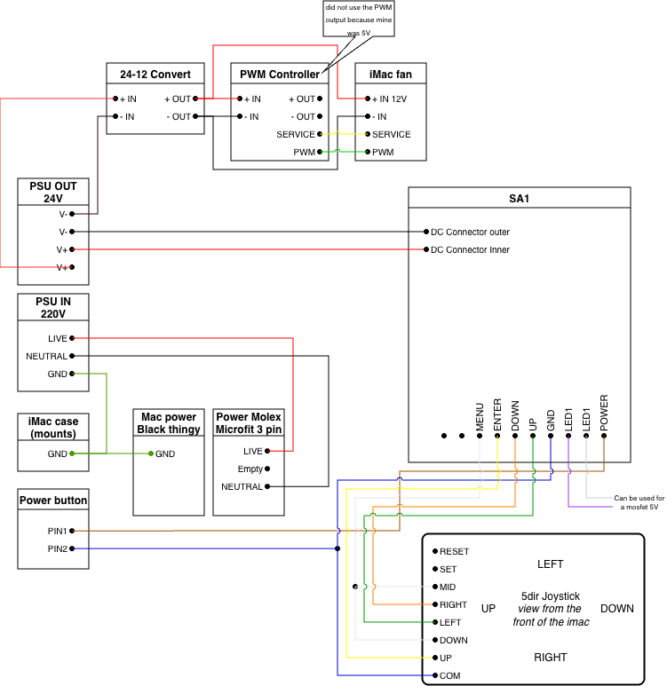

# Fan

# Do I need a case fan?

The iMac aluminium case is quite good at handling heat by himself and many have done fanless solutions.

If you use your controller for more than display, especially for USB-C charging it will draw more power (+65 or 90W) and generate more heat, and you might more fans.

You kan either keep the iMac fan or install a custom one.

# Keeping the iMac fan

## iMac Fan information

- The iMac fan requires 12V (but will work at lower speed starting 5V) If your PSU is 24V you will have to install a converter.
- The 2017 iMac fan pin-out is very similar to a regular 4 pin PC fan pin-out, except that pin 1 and pin 2 are swapped (12V and ground)

*Credit Aiwi*

## Controller
Ideally you also need a PWM fan controller of any kind for your fans no to run a full speed all the time. Depending on your board you may have a controll signal or you can use a model with a temperature probe.

## Wiring example

This example feature a complete wiring example for a SA1 board, the fan is at the top.

# Using the board output

Depending of your chosen card it may have fan, should you want to you can add another one.
It also usually means your card as an PWN controller signal

**Example for R1811**

*Credits Aiwi (Refer to the [R1811 page](../boards/R1811/R1811.md) as why there is a resistor)*

