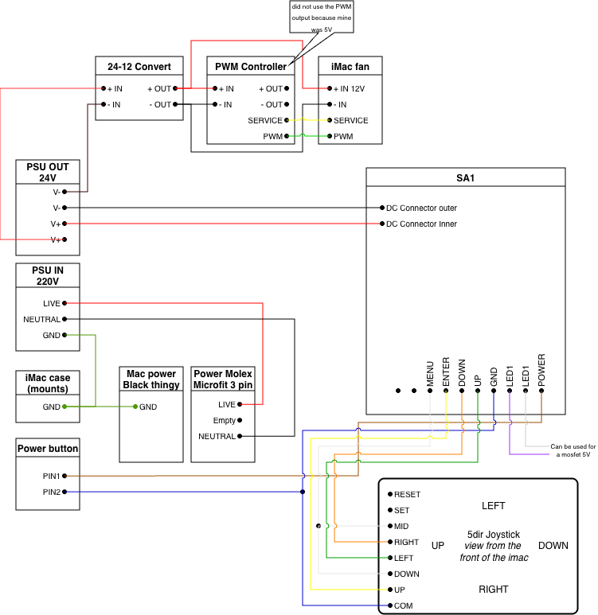

# Keeping the iMac on/off button

If you want to power up your board using the original iMac button you'll need to find the corresponding button on the controller board and solder the mac button cables to it or to the corresponding cable on the cable strip and to the ground.

See the bottom left part here:

Some videos:

- [Video 1](https://youtu.be/UhqxWd7YwGM?si=7HnFeDfw7AAwQGqm&t=564)
- [Video 2 soldered to cable (result only)](https://youtu.be/SS_zWnZI-CY?si=-FgxALWCJuOHpjRu&t=272)
- [Video 3](https://youtu.be/Tdi7kB7x2Z0?si=iMjQdfUkIVFFMqau&t=267)