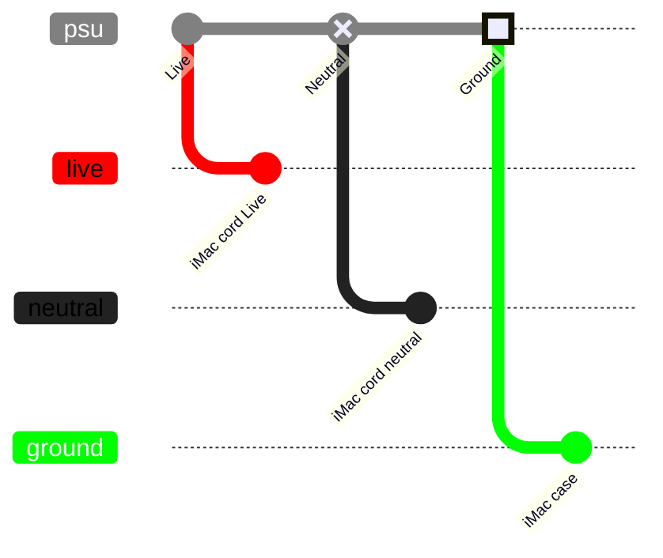
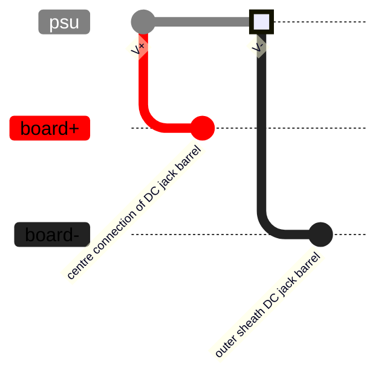
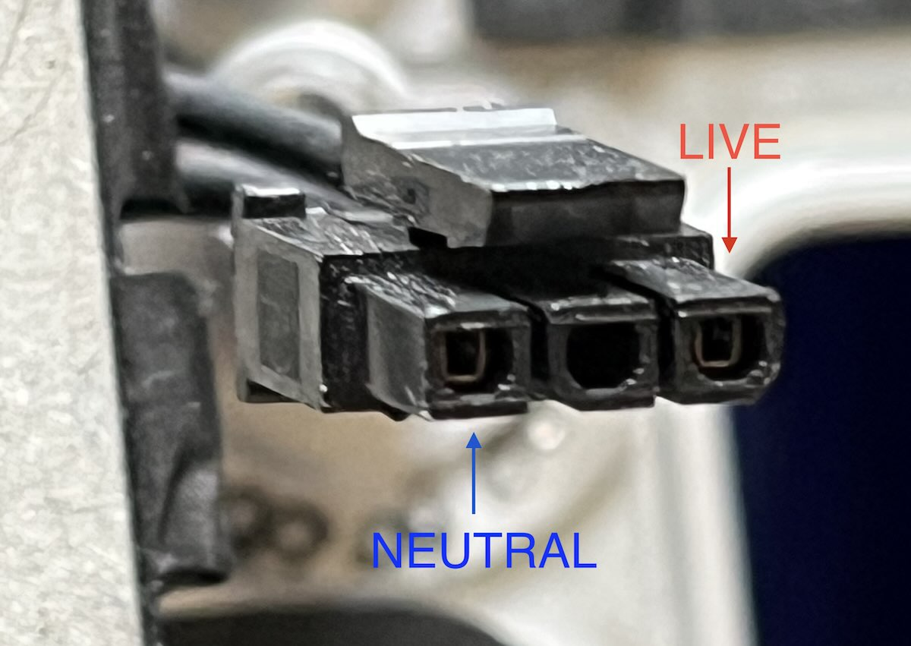

# Power

To power the display you can either

- Keep the iMac PSU. Here is a [post](https://forums.macrumors.com/threads/diy-5k-monitor-success.2253100/post-33572115) about it but most of the moder do not reuse it. It's quite big, only 12V, and does not shut down wit the power button
- Use your own 12/24V PSU. Be careful to have the proper connector. Most board use a DC 2.5mm x 5.5mm.
  - If you plan an using USC-Charging (which cannot be turned off is using USB-C) 150W are recommendd.

## Wiring

### Powering the PSU

The ground is the case. You need to connect your PSU Ground somewhere to the case of the iMac

### Powering the video board

- You should use 22/24 AWG cables (or lower) but not higher. (smaller)
- If you don't intend to use USC-Power a 5A rated nominal current compatible barrel is fine, otherwise, aim for [a higher rated one](https://www.amazon.com/GINTOOYUN-dalimentation-r%C3%A9paration-remplacement-DC5525/dp/B0DGXR4P2S)

# Example PSU

It's really up to your design but one of the most used PSU are the

- LRS-150-24 (or 12)
- LRS-250-24 (a bit bigger)
  as they are quite reliable, cheap and fit well in the case.

# Reuse the iMac Cord

For a cleaner look you can reuse the iMac power cord.

## Polarity

The iMac pin are like this:

_Credits to PaulD_

## Molex

The Molex is a MicroFit 3.0.
The corresponding female is [MOLEX 43640-0301 Micro-Fit 3.0](https://eu.mouser.com/ProductDetail/Molex/43640-0301?qs=P7cO%252B%252BFDLzT6yhSWHXAM7g%3D%3D)
