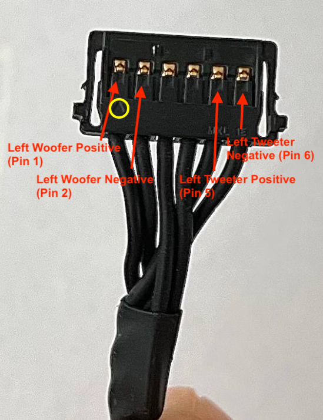

# Speakers

Bear in mind the the original mac speaker will not sound as good as originaly as Apple must do some kind of software magic.

That said, the result can be sufficient for occassional use.

> [!NOTE]  
> Note that not all [boards](../boards/boards.md) deliver the same power to the speakers. If it's really important to you it might orient your board choice.

# Wiring

- You will need to split the trebble and bass using crossovers.
- Be careful as some reported the marking of the pin outputs on the [R1811 may be wrong](https://forums.macrumors.com/threads/diy-5k-monitor-success.2253100/post-32319167)
- You can build your own crossovers but the easiest way is to be some premades
  - Balee 2.1 should theorically sound better : [prewired](https://fr.aliexpress.com/i/1005008109245362.html?gatewayAdapt=vnm2fra)
  - YLY-2088: [prewired](https://stonetaskin.com/products/stonetaskin-high-quaility-treble-bass-speaker-crossover-divider-for-imac-27-inches-a1219-a2115-speaker-board-r1811-r9a18-sa1-fa1?variant=45478038012058) | [nude](https://stonetaskin.com/products/yly-2088-400w-adjustable-2-way-crossover-filters-module-audio-speaker-frequency-divider-full-range-treble-bass?_pos=2&_sid=4bd53215c&_ss=r)

## Cable pins

When the speakers cable is facing you (with the little triangle visible, see yello circle) the pin order is 
- Tweeter -
- Tweeter +
- ID link (ignore)
- ID link (ignore)
- Woofer -
- Woofer +
  

*Credit Yaosiang, same for right one*

## Software

DCC control of speaker might work on the more expensive board. If BetterDisplay does not work, try eqMac.